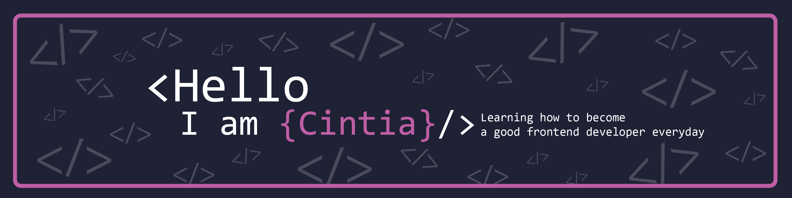

 

  
 

 

 
👋 Hi, I’m Cintia!

👩‍💻 Front-End Enthusiast | Web Developer | Continuous Learner 📚 
📅 Software Engineer since November 2021 | Open to New Opportunities 🚀 
🎓 Recent Graduate in Computer Science: System Analysis and Development at Unicesumar 📖 

 
  
  

 
<table border="0">
  <tr>  
    <td>😍 Hobbies: </td> 
    <td>⚡️ Fun fact about me: </td>
  </tr>
 
  <tr>
    <td>
    📷 Photography: Take photos and keep the moment  
    👩‍🍳 Watch competition shows: like MasterChef  
    🪴 Take care of plants 
    </td> 
    <td>
     🎮 I love playing games like Resident Evil  
     🐼 I love pandas  
     ♟️ I played team chess when I was 13 years old. 
     🧟‍♀️ The kind of film that I love is horror 🤣 
    </td> 
 </tr>
</table>

  
## 🛠 Skills

 
  

 

 

 

## 📄 Projects

 
  
|Project                 | Tech                                             | Repo                                                                    | Link                                                              |
|:-----------------------|:-------------------------------------------------|:------------------------------------------------------------------------|:------------------------------------------------------------------|
| Newshome Page          |  React, Responsive, Mobile first                 | [Github](https://github.com/ciisiq/challenge-news-homepage-main)        | [Demo](https://fm-homepage-news.netlify.app/)                     | 
| Newsletter Sign        |  Javascript, Html, CSS                           | [Github](https://github.com/ciisiq/challenge-newsletter-sign-up)        | [Demo](https://ciisiq.github.io/challenge-newsletter-sign-up/)    | 
| Full stack Sayxiis     |  NodeJS, Express, Postgres/Sequelize, React, CSS | [Github](https://github.com/ciisiq/sayxiis)                             | [None]                                                            |
| JobTracker APP         |  React, Tailwinds, MongoDB, teamwork             | [Github](https://github.com/SchoolOfCode/final-project-repo-bossa-nova) | [Demo](https://bossanova.netlify.app/)                            |
| Full stack Dad's Joke  |  NextJs, Mongoose, Express, Angular, CSS         | [Github](https://github.com/ciisiq/dad-jokes-express-mongoose)          | [None]                                                            |
| Frontend Films Ghibli  |  NextJs, Docker, CSS                             | [Github](https://github.com/ciisiq/studying-nextjs-frontend-ghibli)     | [Demo](https://studying-nodejs-ghibli.vercel.app/)                |
| Backend Films Ghibli   |  Nodejs, Express, Mongoose Docker                | [Github](https://github.com/ciisiq/backend-ghibli-films)                | [None]                                                            |
| Clone website SOC      |  HTML, CSS                                       | [Github](https://github.com/ciisiq/html-soc)                            | [Demo](https://ciisiq.github.io/html-soc/)                        |
| Preview card component |  HTML , CSS                                      | [Github](https://github.com/ciisiq/challenge-preview-card-component)    | [Demo](https://ciisiq.github.io/challenge-preview-card-component/)|
| Interactive Rating     |  Javascript, CSS                                 | [Github](https://github.com/ciisiq/challenge-interactive-rating)        | [Demo](https://ciisiq.github.io/challenge-interactive-rating/)    |
| Simple Counter         |  Javascript, CSS, DOM                            | [Github](https://github.com/ciisiq/simple-counter)                      | [Demo](https://ciisiq.github.io/simple-counter/)                  |
| Memory Game            |  Javascript, CSS, DOM                            | [Github](https://github.com/ciisiq/memory-game)                         | [Demo](https://panda-memory-game.netlify.app/)                    |
| Blackjack Game         |  Javascript, CSS, JQuery                         | [Github](https://github.com/ciisiq/blackjack-game)                      | [Demo](https://blackjack-game-ci.netlify.app/)                    |
| QR Code component      |  HTML, CSS                                       | [Github](https://github.com/ciisiq/challenge-QR-code-component)         | [Demo](https://challenge-qrcode.vercel.app/)                      |
| To do List             |  Javascript, CSS                                 | [Github](https://github.com/ciisiq/studying-to-do-js)                   | [Demo](https://ciisiq.github.io/studying-to-do-js/)               |
| My portfolio website   |  React, SCSS                                     | [Github](https://github.com/ciisiq/first-portfolio)                     | [Demo](https://cisiq.dev/)                                        |
| News App               |  React, SCSS, Cypress, API                       | [Github](https://github.com/ciisiq/news-app)                            | [Demo](https://news-percayso-test.netlify.app/)                   |
| Hackathon News website |  React, CSS, teamwork                            | [Github](https://github.com/D20CM/news-hackathon)                       | [Demo](https://master--news-hackathon.netlify.app/)               |
| Hackathon Holiday app  |  React, CSS, teamwork                            | [Github](https://github.com/NicholasGomis/TheFourHorsemen)              | [None]                                                            |  

## 📄 Work

 
  
|Project                      | Tech                          |  Link                                                                   |
|:----------------------------|:------------------------------|:------------------------------------------------------------------------|
| Full Stack Health Boss      |  Nextjs v3, Prisma, Tailwinds | [Demo](https://health-boss.vercel.app/)                                 |
| Servi home Improvements     |  Nextjs v3, Prisma, Tailwinds | [Demo](https://servihome-demo-miklyxs-projects.vercel.app/)             |
| The Children's wood website |  Wordpress, CSS               | [Demo](https://thechildrenswood.co.uk/)                                 |

 

